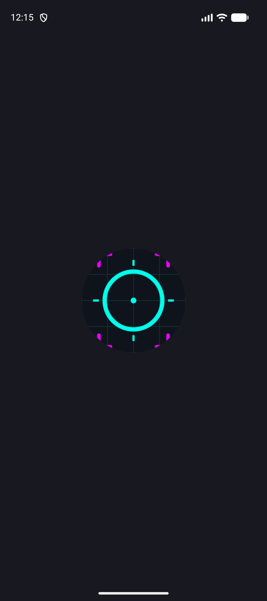
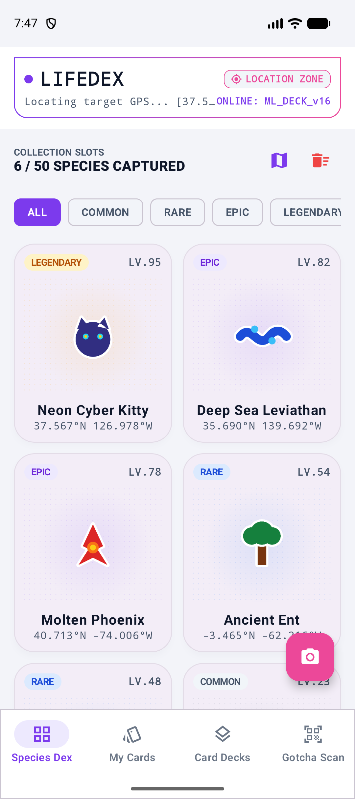
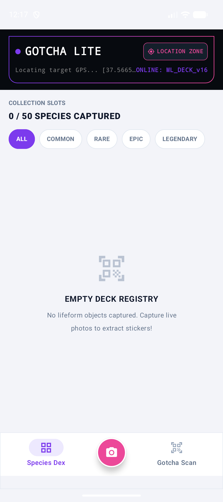

# Gotcha Lite (Lifedex) 📸👾
**온디바이스 AI 누끼 추출 & 실시간 생성형 AI 기반 수집형 카드 도감 앱**

Gotcha Lite는 일상 속 사물이나 반려동물을 카메라로 촬영하거나 갤러리에서 선택하여, 외부 서버 통신 없이 디바이스 내에서 배경을 투명하게 지우고(**온디바이스 누끼 추출**), 이를 크리처 스타일의 **수집용 디지털 카드**로 가공하여 지도와 도감에 기록하는 네이티브 안드로이드 어플리케이션입니다.

---

## 🌟 핵심 기능 (Core Features)

### 1. 온디바이스 피사체 분리 (ML Kit Subject Segmentation)
* **100% 오프라인 배경 제거**: Google Play Services의 `Subject Segmentation` API를 사용하여 네트워크 연결 없이 기기 내부에서 인스턴스 단위 피사체와 배경을 완벽히 분리합니다.
* **스티커 이펙트**: 추출된 피사체 경계선에 15px 두께의 흰색 테두리 효과를 가미하여 실제 오프라인 스티커 같은 세련된 마감처리를 적용합니다.
* **다중 객체 선택**: 이미지 내 여러 개의 사물이 탐지되었을 때 사용자가 직접 마스크 레이아웃 터치를 통해 원하는 피사체를 선택할 수 있는 다중 객체 선택 인터페이스를 지원합니다.

### 2. 클라우드 백업 객체 분리 (Gemini Polygon Fallback)
* **다단계 예외 대응**: 디바이스 사양이나 ML Kit 미설치 상황, 또는 특정 OS 버전(Android 16 등)에서의 GPU 라이브러리 네이티브 예외 시 동작하는 세이프티 넷(Safety Net)입니다.
* **구조화된 다각형 마스킹**: Gemini API의 JSON 스키마 응답을 활용하여 피사체의 바운딩 박스 및 20~30개 좌표의 다각형(Polygon)을 획득하고, Kotlin `Path` 클리핑을 통해 피사체를 정교하게 크롭합니다.

### 3. 생성형 AI 명칭 및 태그 추천 (Gemini Grounding with Google Search)
* **실시간 구글 검색 연동**: 단순히 "고양이", "머그컵" 같은 범용 단어가 아니라, 실시간 구글 검색 결과(Grounding)를 토대로 실제 식물/동물의 세부 품종명 및 전자기기의 정확한 모델명을 추론합니다.
* **연관 한국어 태그**: 피사체를 대변하는 연관 명사 태그 3가지를 한국어로 자동 추천하며, 사용자가 직접 수동 편집 및 타이틀을 커스텀 입력할 수 있습니다.

### 4. 로컬 캔버스 크리처 카드 생성 (Local Card Generator)
* **등급별 테마 그라데이션**: 획득한 등급(Common, Rare, Epic, Legendary)에 따른 그라데이션 컬러 및 노란색 아웃라인 합성.
* **레벨 및 HP 연산**: 무작위 레벨(Lv. 10 ~ 100)을 부여하고 이에 따라 체력(HP)을 자동으로 산출하여 드로잉합니다.
* **네이티브 캔버스 렌더링**: 기기 자체 Android `Canvas` 상에서 텍스트 스타일, 등급 뱃지, 저작권 문구("© Gotcha-Lite AI Studio") 등을 100% 직접 드로잉하여 실시간 완성형 카드 비트맵을 생성합니다.

### 5. 오픈스트리트맵 수집 기록 (osmdroid World Map)
* **GPS 위치 기반 기록**: `FusedLocationProviderClient`를 통해 포그라운드 대략적 위치(ACCESS_COARSE_LOCATION)를 가져와 획득 장소를 로깅합니다.
* **무권한 대응 핫스팟 시스템**: 사용자가 GPS 권한을 거부할 경우, 세계 주요 탐험지(Area 51, 버뮤다 삼각지대, 에베레스트 정상, 도쿄 스카이트리, 서울광장, 아마존 우림) 6곳의 무작위 좌표에 가상 오프셋을 가미하여 할당합니다.
* **크롭 스티커 마커**: 지도상의 마커 핀을 획득한 사물의 누끼 스티커 이미지(120x120px)로 실시간 교체하여 지도 위에 내 수집 목록을 직관적으로 확인할 수 있습니다.

### 6. 도감 그리드 및 삭제 관리 (Dex View)
* **2열 그리드 목록**: 수집한 도감 카드를 한눈에 보여주는 깔끔한 뷰.
* **상세 보기 및 소거**: 카드를 선택하면 전체 스펙이 노출되는 다이얼로그가 실행되며, 영구 삭제(`Delete`) 및 전체 초기화(`Clear All`)를 지원해 저장 공간을 관리할 수 있습니다.

---

## 🛠 시스템 회복성 및 최적화 (System Resilience)

1. **Android 16 ML Kit GPU 메모리 크래시 방지**: Android 16 기기에서 ML Kit 누끼 모듈 작동 시 네이티브 단에서 발생하는 메모리 버퍼 에러를 차단하기 위해, 비트맵 크기의 가로/세로 해상도가 **16의 배수**가 되도록 절삭 전처리(Alignment)를 엄격히 수행합니다.
2. **Gemini API 429(Rate Limit) 대응 및 다단계 백업**:
   - `retryAfter` 기반의 지연 후 자동 재시도 로직 탑재.
   - API 장애 또는 지연 시 `gemini-2.5-flash` → `gemini-3.5-flash` → `gemini-2.5-flash-lite` 순서로 모델을 동적 스위칭합니다.
3. **가비지 컬렉션 및 저장 최적화**: 원본 이미지는 가로/세로 최대 800px로 다운샘플링하여 JVM OOM을 원천 차단하고, DB에서 카드를 제거하는 즉시 물리 저장소에 저장된 스티커 및 카드 PNG 파일도 영구 제거합니다.

---

## 💻 기술 스택 (Tech Stack)

* **언어**: Kotlin 1.9.x
* **UI 프레임워크**: Jetpack Compose (Material 3)
* **로컬 DB**: Room Database (SQLite)
* **온디바이스 AI**: Google Play Services ML Kit Subject Segmentation
* **클라우드 LLM**: Gemini API (REST 연동 via OkHttp3)
* **지도**: osmdroid-android (`6.1.18`)
* **이미지 로더**: Coil Compose (`2.6.0`)

---

## 📂 프로젝트 구조 (Project Structure)

```
lifedex/
├── app/
│   ├── src/
│   │   ├── main/
│   │   │   ├── java/com/lifedex/
│   │   │   │   ├── MainActivity.kt        # 메인 액티비티 및 Compose Navigation 컨트롤러
│   │   │   │   ├── data/                  # Room Entity, DAO, Database 및 레포지토리
│   │   │   │   │   ├── GotchaCard.kt
│   │   │   │   │   ├── GotchaDao.kt
│   │   │   │   │   └── ...
│   │   │   │   ├── service/               # 누끼 엔진, Gemini API 연동, 크리처 카드 생성기
│   │   │   │   │   ├── NukiService.kt
│   │   │   │   │   ├── GeminiClient.kt
│   │   │   │   │   └── CardGenerator.kt
│   │   │   │   ├── ui/                    # 화면 뷰모델, UI 상태정의, 지도 스크린
│   │   │   │   │   ├── GotchaViewModel.kt
│   │   │   │   │   ├── MapScreen.kt
│   │   │   │   │   ├── components/        # 다이얼로그, 바텀바 등 공통 UI 컴포넌트
│   │   │   │   │   └── screens/           # 도감 목록 및 스캐너 워크스페이스 화면
│   │   │   │   └── utils/                 # 비트맵 절삭/다운샘플링 등 헬퍼 유틸
│   │   │   └── res/                       # 아이콘 및 리소스 파일
├── assets/                                # 앱 스크린샷 이미지
└── build.gradle.kts                       # 루트 프로젝트 빌드 스크립트
```

---

## 🚀 시작하기 (Getting Started)

### 1. 요구 사항
* Android Studio Koala 이상 권장
* Android SDK 34 (compileSdk: 36, minSdkVersion: 24, targetSdkVersion: 35)
* Gemini API Key (Google AI Studio에서 발급 가능)

### 2. API Key 설정
이 프로젝트는 **Secrets Gradle Plugin**을 탑재하여 환경 변수 파일로부터 API Key를 안전하게 주입받습니다.
프로젝트 루트 디렉터리에 `.env` 파일을 생성하고 발급받은 Gemini API Key를 작성해 주세요.
```properties
GEMINI_API_KEY=your_actual_gemini_api_key_here
```

### 3. 빌드 및 설치
1. 저장소를 클론합니다.
   ```bash
   git clone https://github.com/JAICHANGPARK/lifedex.git
   cd lifedex
   ```
2. Android Studio에서 프로젝트를 오픈한 후, Gradle Sync를 진행합니다.
3. 기기 또는 에뮬레이터를 연결하고 실행(Run)합니다.
   *(최초 실행 시 구글 플레이 서비스가 온디바이스 누끼 세그멘테이션 모델을 백그라운드에서 다운로드하므로 인터넷 연결이 일시적으로 필요합니다.)*

---

## 📸 스크린샷 (Screenshots)

앱의 동작 및 UI 예시입니다.

| 스캐너 워크스페이스 (Scan) | 도감 그리드 목록 (Dex) | 수집 월드 맵 (Map) |
|:---:|:---:|:---:|
|  |  |  |

*(더 많은 스크린샷은 [assets](assets) 폴더에서 확인하실 수 있습니다.)*

---

## 📜 라이선스 (License)

본 프로젝트는 [MIT License](LICENSE)에 따라 배포됩니다.
