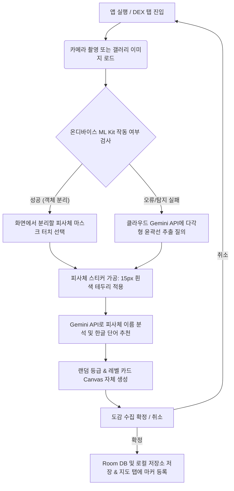

# Product Requirements Document (PRD) - Gotcha Lite

본 문서는 온디바이스 AI 기술과 클라우드 LLM을 결합하여 일상 속 사물을 나만의 스티커와 수집 카드로 만드는 안드로이드 어플리케이션 **Gotcha Lite**의 제품 요구사항 및 기술 사양을 정의합니다.

---

## 1. 제품 개요 (Product Overview)

### 1.1 제품의 목적 및 비전
* **Gotcha Lite**는 실생활 속 사물이나 반려동물 등을 카메라로 촬영하거나 갤러리에서 불러와 배경을 투명하게 지우고(**누끼 추출**), 이를 귀여운 스티커 및 크리처 스타일의 **수집용 디지털 카드**로 변환하여 나만의 도감에 모으는 네이티브 안드로이드 앱입니다.
* 획득한 위치(GPS Coordinates) 정보를 바탕으로 오픈소스 지도 위에 수집한 위치를 시각화하여, 현실 세계를 탐험하며 수집(Dex)을 완성하는 재미를 제공합니다.

### 1.2 핵심 가치 (Core Values)
* **재미(Gamification):** 레벨, 등급(Rarity), 체력(HP) 등의 무작위 요소를 도입하여 카드 수집의 몰입감을 극대화합니다.
* **디바이스 독립성 및 최적화:** 기기 자체의 무권한 미디어 수집(Photo Picker) 및 온디바이스 ML Kit 세그멘테이션을 결합하여 개인 정보 보호와 처리 속도를 보장합니다.
* **강력한 예외 처리(Fallback Mechanism):** 특정 기기(Android 16 등)에서의 하드웨어 호환성 장애 또는 클라우드 API 호출 한도 초과 상황에서도 서비스가 원활히 작동하도록 다단계 폴백 시스템을 갖추었습니다.

---

## 2. 타겟 사용자 및 주요 시나리오 (Target Audience & Scenarios)

### 2.1 타겟 사용자
1. **수집 게임을 좋아하는 사용자:** 몬스터 수집형 게임(카드 수집 등)처럼 일상의 물건들을 카드로 박제하고 등급을 확인하는 것을 즐기는 유저.
2. **반려인 및 스티커 수집가:** 키우는 반려동물이나 인형 등을 나만의 고유한 스티커 이미지로 소장하려는 사용자.
3. **탐험/로깅을 좋아하는 사용자:** 자신이 방문한 장소에서 획득한 물체들을 지도 위에 기록하고 싶은 여행가.

### 2.2 사용자 시나리오 (User Journey)


---

## 3. 핵심 기능 요구사항 (Core Feature Requirements)

### F-1. 미디어 획득 및 촬영 (Capture & Pick)
* **갤러리 이미지 선택:** `PickVisualMedia` API를 적용해 권한 팝업 없이도 사용자의 사진 앨범에 안전하게 접근합니다.
* **카메라 촬영:** 카메라 권한 승인 하에 `TakePicturePreview`를 실행하여 썸네일 이미지를 촬영하고 캐시 파일 주소(`Uri`)로 즉시 변환하여 스캔 단계로 진입합니다.

### F-2. 다중 객체 온디바이스 누끼 추출 (ML Kit Subject Segmentation)
* **주요 기능:** 구글 플레이 서비스의 `play-services-mlkit-subject-segmentation`을 활용하여 인스턴스 단위 피사체와 배경을 완전히 분리합니다.
* **다중 객체 선택 인터페이스:** 이미지 내에서 여러 객체가 탐지된 경우 복합 마스크 레이아웃(`combinedMaskOverlay`)을 띄워 사용자가 직접 원하는 피사체를 선택할 수 있도록 합니다.
* **스티커 이펙트 구현:** 분리된 피사체 엣지에 알파 채널 추출 및 15px 두께의 흰색 페인트 드로잉을 가미하여 **오프라인 스티커 스타일**의 마감 처리를 구현합니다.

### F-3. 클라우드 백업 객체 분리 (Gemini Polygon Fallback)
* **도입 배경:** 온디바이스 모델 미다운로드 상태이거나, Android 16 기기 단의 `drishti_gl_runn` 라이브러리 `SIGSEGV` 네이티브 예외 발생 시의 세이프티 넷.
* **동작 기작:** Gemini API의 구조화된 JSON 응답(`responseSchema`)을 통해 피사체의 바운딩 박스와 20~30개 지점의 정규화 좌표 다각형(Polygon)을 획득, Kotlin 내부 `Path` 클리핑 및 `Canvas` 마스크 렌더링으로 피사체를 크롭합니다.

### F-4. 생성형 AI 및 실시간 검색 기반 한국어 명칭 및 연관 태그 추천 (Gemini Object Naming with Google Search Grounding)
* **동작 기작:** 
  * 분리된 사물 비트맵(또는 주변부 크롭 비트맵)을 Gemini API에 분석 요청할 때, **Grounding with Google Search** 도구를 활성화합니다.
  * 단순히 "고양이", "풀", "자동차"와 같은 대분류 명칭 대신 실시간 구글 검색 데이터를 참조하여 실제 품종(예: 러시안 블루, 샴 고양이), 세부 식물 종명(예: 소나무, 몬스테라), 특정 기기/사물의 모델명 등 구체적적이고 사실적인 이름을 유도합니다.
  * 분석 결과를 토대로 연관 명사 3가지를 한국어로 자동 추천합니다. (예: `["러시안 블루", "고양이", "반려동물"]`)
* **사용자 편집 가능:** 추천 단어를 즉시 선택하거나, 유저가 마음에 드는 커스텀 타이틀을 입력할 수 있습니다.

### F-5. 로컬 캔버스 크리처 카드 생성 (Local Card Generator)
* **그라데이션 및 UI 스타일링:** 획득한 등급별 무작위 그라데이션 바탕과 노란색 아웃라인 보더를 합성합니다.
* **레벨 및 HP 자동 부여:** 무작위 생성된 레벨(Lv. 10~100)을 기초로 체력(`HP = Lv * 10 + 50`)을 자동 환산하여 카드 우측 상단에 표시합니다.
* **로컬 드로잉 기법:** 텍스트 크기, 폰트 스타일, 하단 라이선스 표기("© Gotcha-Lite AI Studio") 등을 기기 자체 Android `Canvas` 상에서 100% 드로잉하여 실시간으로 카드 형태 비트맵을 완성합니다.

### F-6. 오프라인 오픈스트리트맵 수집 기록 (osmdroid World Map)
* **위치 수집:** 포그라운드 대략적 위치 권한을 통해 `FusedLocationProviderClient`로 현재 위/경도(GPS) 좌표를 취득합니다.
* **권한 거부 대응:** 사용자가 위치 권한을 거부할 경우 시뮬레이션된 세계 주요 탐험 핫스팟 6곳(Area 51, 버뮤다 삼각지대, 에베레스트 정상, 도쿄 스카이트리, 서울광장, 아마존 우림) 좌표 중 한 곳을 무작위 선택하고 오프셋을 가미하여 할당합니다.
* **지도 상 핀 표시:** `osmdroid` 라이브러리를 사용해 지도 탭에 수집된 카드 위치 마커를 띄우며, 마커 내 아이콘을 **수집된 크롭 스티커 이미지(120x120px)**로 직접 교체하여 높은 가독성을 제공합니다.

### F-7. 도감 목록 및 영구 소거 (Dex Grid View)
* **목록화:** 저장된 모든 도감 카드를 2열(또는 화면 너비 맞춤) 그리드 리스트로 확인합니다.
* **카드 디테일 뷰:** 카드를 클릭하면 크게 띄워 상세 스펙을 보이며, 개별 카드를 완전히 파기(`Delete`)하거나 전체 컬렉션을 초기화(`Clear All`)하여 저장소 관리를 원활하게 합니다.

---

## 4. 기술 스택 및 종속성 (Technical Stack)

| 구분 | 주요 기술 / 라이브러리 | 역할 |
|---|---|---|
| **개발 언어** | Kotlin | 애플리케이션 비즈니스 로직 및 안드로이드 코딩 |
| **UI 프레임워크** | Jetpack Compose | 머티리얼 3 디자인 표준 기반 네이티브 UI 레이아웃 |
| **로컬 DB** | Room Database (SQLite) | 수집된 도감 카드 메타데이터 영구 보관 |
| **온디바이스 AI** | Google Play ML Kit Subject Segmentation | 디바이스 단의 오프라인 배경 제거 (누끼) |
| **클라우드 LLM** | Gemini 2.5 Flash / 3.5 Flash (API Key) | 사물 이름 추론(Google Search Grounding 포함) 및 다각형 크롭 좌표 생성 폴백 |
| **네트워킹** | OkHttp3 | REST API 기반 수동 Gemini HTTP 연동 (429 복구 및 Grounding 툴 사용 특화) |
| **지도 라이브러리** | osmdroid (`org.osmdroid:osmdroid-android:6.1.18`) | 무권한/무결제 세계 지도 타일 렌더링 및 핀 마커 표시 |
| **이미지 로더** | Coil (`io.coil-kt:coil-compose:2.6.0`) | 로컬 파일 시스템 경로 비트맵 비동기 렌더링 |

---

## 5. 핵심 예외 처리 및 회복 설계 (System Resilience)

### 5.1 Android 16 ML Kit GPU 메모리 크래시 방지
* **현상:** Android 16 기기에서 ML Kit 누끼 모듈 구동 시 `drishti_gl_runn` 네이티브 단에서 크래시 발생.
* **조치:** 입력 이미지 비트맵을 ML Kit 엔진에 전달하기 전, 가로와 세로 해상도가 **16의 배수**가 되도록 절삭 전처리(Alignment)를 엄격히 수행하여 버퍼 정렬 에러를 방지했습니다.
  ```kotlin
  var w = originalBitmap.width
  var h = originalBitmap.height
  if (w % 16 != 0 || h % 16 != 0) {
      w = w - (w % 16)
      h = h - (h % 16)
      safeBitmap = Bitmap.createScaledBitmap(originalBitmap, w, h, true)
  }
  ```

### 5.2 Gemini API 호출 제한 (Rate Limit 429) & 다단계 모델 백업
* **현상:** 사용량 과다로 일시적 HTTP 429(Too Many Requests) 에러 발생 및 지연 현상.
* **조치:** 
  1. **자동 백오프 재시도:** 429 감지 시 응답 내의 `retryDelay` 값(기본 25초) 만큼 코루틴 일시 정지(delay) 후 재시도 수행.
  2. **다단계 모델 폴백:** 최신 고성능 모델 장애 시 `gemini-2.5-flash` → `gemini-3.5-flash` → `gemini-2.5-flash-lite` 순서로 호출 대상을 스위칭하여 중단 없는 처리 보장.

### 5.3 Gemini API 지원 종료(Deprecated) 모델 배제 및 지식 베이스(Knowledge Base) 한계 명시
* **이슈:** 
  * 개발 도구 및 에이전트의 지식 베이스(Knowledge Base)가 구형인 경우, 이미 지원 종료(Deprecated)되었거나 중단 예정인 구형 모델(예: 초기 1.0/1.5 버전 계열)을 기본값으로 추천하거나 사용하는 문제가 발생할 수 있습니다.
  * 최신 API 스펙과 모델이 빠르게 출시됨에 따라 구형 지식 베이스에만 의존할 경우 실시간 최신 모델을 누락할 가능성이 존재합니다.
* **대응 지침:**
  * **지원 종료 모델 배제:** 성능이 저하되거나 서비스가 일몰(Sunset)되는 구형 모델의 사용을 엄격히 배제하며, 프로덕션 코드에서는 항상 정식 출시된 최신 안정화 모델을 명시적으로 사용해야 합니다.
  * **유연한 수동 연동 아키텍처:** 신규 모델이 출시되었을 때 SDK 업데이트 없이도 기민하게 대응할 수 있도록, 하드코딩된 모델 스펙을 동적으로 변경하기 편리한 OkHttp REST API 수동 연동 방식을 채택하여 유지보수성을 극대화합니다.

### 5.4 로컬 이미지 압축 및 가비지 수집
* **최적화:** 기기 카메라로 대용량 사진 촬영 시 원본 화질을 제한(최대 가로/세로 800px로 다운샘플링)하여 기기 저장 공간 절약 및 JVM OOM(Out of Memory) 방지.
* **소거 정책:** Room DB에서 특정 카드를 제거하는 순간, 물리 저장소의 스티커 PNG 파일과 생성된 카드 PNG 파일도 동시 제거하여 잔여 임시 파일이 디바이스 저장소를 채우지 않도록 설계함.

---

## 6. 도감 데이터베이스 스키마 (Entity Schema)

### `GotchaCard` Table Schema
```kotlin
@Entity(tableName = "gotcha_cards")
data class GotchaCard(
    @PrimaryKey(autoGenerate = true) val id: Int = 0,
    val title: String,                // 피사체 명칭 (Gemini 생성/유저 수정)
    val imagePath: String,            // 배경이 지워진 누끼 스티커 물리 경로
    val cardImagePath: String? = null, // 완성된 크리처 카드 이미지 물리 경로
    val latitude: Double,             // 획득 시 위도
    val longitude: Double,            // 획득 시 경도
    val rarity: String,               // 등급 (COMMON, RARE, EPIC, LEGENDARY)
    val level: Int,                   // 레벨 (10 ~ 100)
    val timestamp: Long               // 수집 시점 타임스탬프
)
```

---

## 7. 향후 확장 로드맵 (Future Roadmap)
1. **소셜 카드 공유 기능:** 완성된 크리처 카드를 인스타그램 스토리나 카카오톡으로 즉시 내보낼 수 있는 공유 Intent 시스템 연동.
2. **사운드 및 스캔 햅틱 피드백:** 레이저 훑기 연출 시 디바이스 햅틱 모터 및 고음질 SFX 효과음을 추가하여 스캔 중 손맛 향상.
3. **등급별 카드 특수 홀로그램 연출:** 자이로스코프 센서를 이용해 기기를 기울일 때 LEGENDARY 등급 카드가 무지개 빛으로 반사되는 셰이더 효과 도입.
